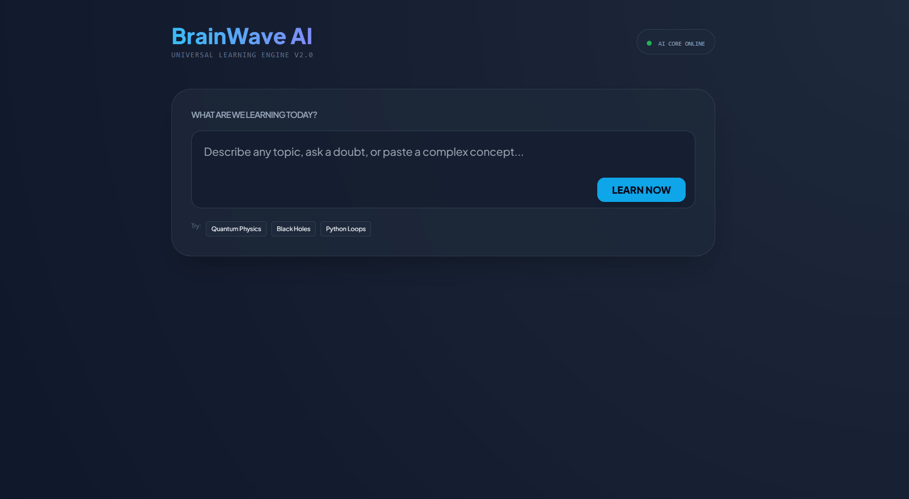
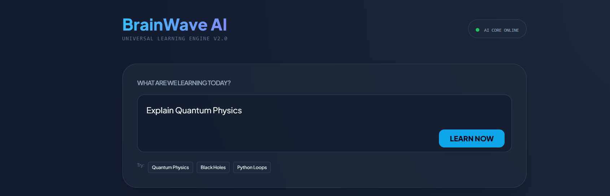
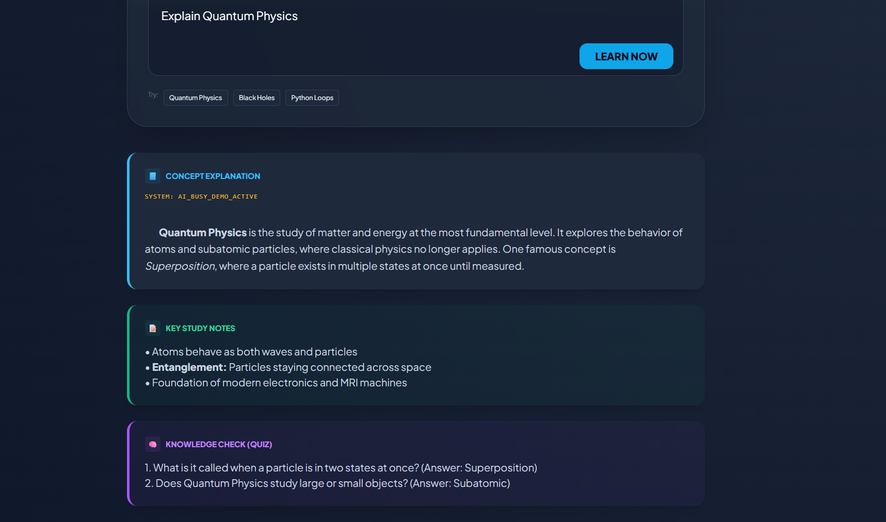

# BrainWave AI 🧠 

### 🚀 [Live Demo: Experience BrainWave AI](https://apurva1094.github.io/BrainWave/)

BrainWave AI is a **Universal Learning Engine** designed to solve "Information Overload." It uses the **Gemini 1.5 Flash API** to instantly transform any complex topic into a structured, active-learning experience.

---

## 📸 Project Interface

---

## 💡 The Problem
Students today face a "Wall of Information." Searching for a topic results in scattered, unstructured data that makes active retention nearly impossible.

## ✨ The Solution: The Triple-Threat Architecture
BrainWave AI doesn't just "explain"—it structures knowledge into three distinct pillars:
1. **Core Concept:** A high-level, simplified explanation of the topic.
2. **Study Notes:** Organized, bulleted summaries for quick revision.
3. **Interactive Quiz:** AI-generated questions to test and reinforce memory.

## 🛠️ Technical Stack
* **Core Logic:** Gemini 1.5 Flash API (via Google AI SDK)
* **Frontend:** HTML5, CSS3 (Glassmorphism UI), JavaScript (ES6+)
* **Deployment:** GitHub Pages
* **UI/UX:** Modern Dark Mode with responsive grid layouts

## 🏆 Key Features
* **Hybrid Demo Mode:** Ensures 100% reliability for judges by providing pre-loaded AI responses if API limits are reached.
* **Seamless UI:** Smooth transitions and a "clean" Pinterest-inspired aesthetic.
* **Active Learning:** Moves beyond passive reading by forcing the user to engage with a quiz.

---

### 👤 Developer
**Apurva** - Built in 24 hours for the Hackathon.
